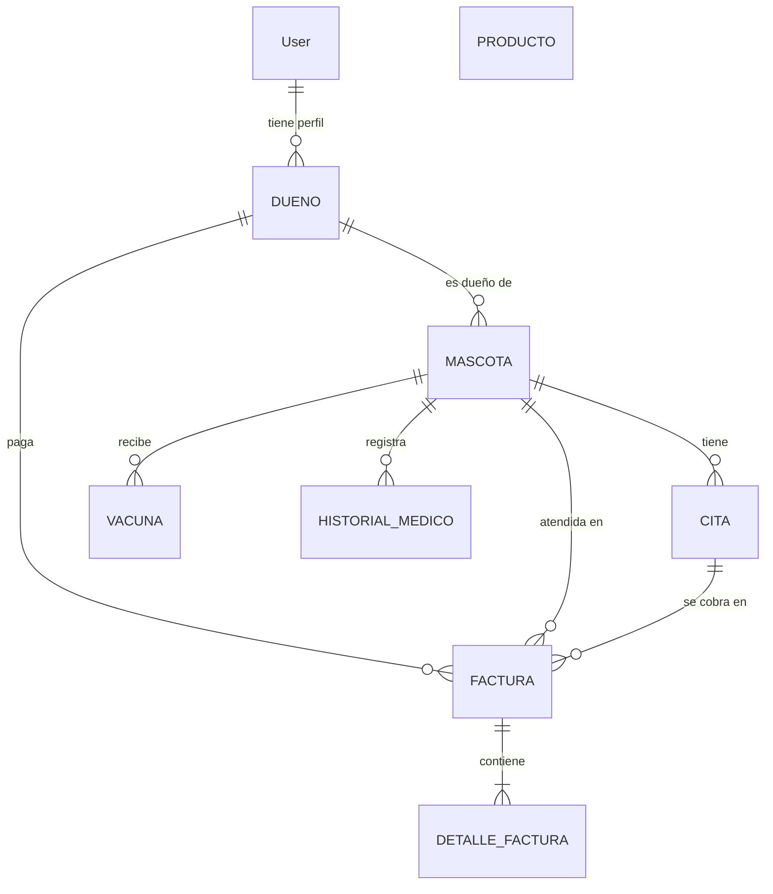

# Sistema de Gestión - Clínica Veterinaria (Caso 5)

Proyecto Django de la Evaluación de Programación Back End. Es un sistema web
para que una clínica veterinaria gestione mascotas, dueños, citas, vacunas,
historial médico, facturación e inventario, con permisos por rol y base de
datos PostgreSQL en Supabase.

**Integrantes:** Jesús Torres, Joel, Gabriel.

---

## Cumplimiento de los requisitos de la evaluación

| # | Requisito | Dónde se cumple |
|---|-----------|-----------------|
| 1 | BD PostgreSQL online (Supabase) | `DATABASE_URL` en `.env`, leído con `dj-database-url` en `veterinaria/settings.py` |
| 2 | Django 4.2+ con `settings.py` usando `.env` | Django 4.2.30; `SECRET_KEY`, `DEBUG`, `ALLOWED_HOSTS`, BD y correo salen de `.env` (`python-dotenv`) |
| 3 | Mínimo 5 commits progresivos | Historial J1–J8, JO1–JO5 y GA1–GA5 (ver al final) |
| 4 | Admin con `list_display` + `search_fields` + `list_filter` | `mascotas/admin.py`: los 8 modelos, con inlines, acciones masivas y filtro por semáforo |
| 5 | CRUD completo con validación | Mascotas, dueños, citas, vacunas, historial, facturas e inventario (formularios en `mascotas/forms.py`) |
| 6 | Login / logout | `django.contrib.auth.urls`, plantilla `registration/login.html`, logout por POST |
| 7 | Permisos: cada usuario ve/edita sus datos o según rol | `@permission_required` en cada vista + `mascotas/permisos.py` (filtro por dueño) + grupos de `setup_grupos` |
| 8 | CSRF + validación en formularios | `` en todos los formularios; acciones sensibles solo por POST (`@require_POST`); `clean_*` y `clean()` |
| 9 | Manejo de errores con try/except y mensajes claros | `try/except DatabaseError` + `logger` + `messages` en todas las vistas; fallas de correo capturadas |
| 10 | `.env` en `.gitignore` | `.gitignore` incluye `.env`; se sube solo `.env.example` sin claves |

---

## Modelos (8) y relaciones



| Modelo | Para qué sirve |
|--------|----------------|
| `Dueño` | Perfil del dueño, unido a un `User` para que pueda iniciar sesión |
| `Mascota` | Paciente: especie, raza, edad, estado de vacunación, dueño |
| `Cita` | Hora agendada con veterinario, motivo y estado |
| `HistorialMedico` | Diagnóstico y tratamiento de cada atención |
| `Vacuna` | Dosis aplicada, lote y fecha del refuerzo |
| `Factura` | Cobro al dueño (pendiente / pagada / anulada) |
| `DetalleFactura` | Líneas de la factura; neto, IVA y total se calculan |
| `Producto` | Inventario con semáforo de stock y vencimiento |

---

## Roles y permisos

Se crean con `python manage.py setup_grupos`:

| Grupo | Qué puede hacer |
|-------|-----------------|
| **Administradores** | Todo: CRUD de los 8 modelos y envío de alertas |
| **Veterinarios** | Ven todo; gestionan citas, vacunas, historial y stock (no borran mascotas ni facturan) |
| **Clientes** | Solo lectura y **solo de sus propias mascotas** (citas, vacunas, historial, facturas) |

La regla "cada uno ve lo suyo" está en un solo lugar, `mascotas/permisos.py`,
y la usan las vistas, el panel, los reportes, el carnet PDF y el admin. Si un
cliente intenta abrir un registro ajeno recibe un 404.

---

## Instalación (Windows)

```bash
python -m venv venv
venv\Scripts\activate            # en Linux/Mac: source venv/bin/activate
pip install -r requirements.txt

copy .env.example .env            # y completar SECRET_KEY y DATABASE_URL
python manage.py migrate          # crea/actualiza las tablas en Supabase
python manage.py createsuperuser
python manage.py setup_grupos     # grupos Administradores, Veterinarios, Clientes
python manage.py seed_demo --password "UnaClaveSegura123"   # datos para la demo (opcional)

python manage.py runserver
```

Abrir `http://127.0.0.1:8000/` (lleva al panel después de iniciar sesión).

### Base de datos en Supabase

En Supabase: *Project Settings → Database → Connection string → URI*. Copiar
la URL del *pooler* en `DATABASE_URL` del `.env`. Si `DATABASE_URL` está vacío
se usa SQLite local (útil para desarrollar sin internet).

### Correo (alertas de vacunas)

Completar las variables `EMAIL_*` del `.env`. Con Gmail se usa una
"contraseña de aplicación". **Sin `EMAIL_HOST_PASSWORD` los correos se
imprimen en la consola**, así la demo funciona sin cuenta de correo.

---

## Comandos propios

| Comando | Qué hace |
|---------|----------|
| `setup_grupos` | Crea o actualiza los 3 grupos con sus permisos |
| `seed_mascotas` | Carga 6 mascotas de ejemplo |
| `seed_demo --password X` | Usuarios `veterinario_demo` y `cliente_demo` + citas, vacunas, facturas y productos |
| `enviar_alertas_vacunas [--simular] [--dias N]` | Envía los recordatorios de refuerzo por correo |

---

## Pruebas

```bash
python manage.py test mascotas
```

54 pruebas (las pruebas usan SQLite, no tocan Supabase):

- `mascotas/tests.py`: modelo Mascota, lista y filtros, permisos, validación,
  sanitización, errores de base de datos y grupos.
- `mascotas/test_avanzado.py`: dueños, citas y choques de horario, ficha,
  alertas y correo, carnet PDF, facturación, panel, CSV, roles e inventario.

---

## Infraestructura y modelos base — Jesús (PUNTO 1)

- **J1**: `.gitignore` + `requirements.txt` con python-dotenv.
- **J2**: `settings.py` con carga desde `.env` + `.env.example`.
- **J3**: modelo `Mascota` con validadores y `estado_vacunacion`, migraciones y conexión a Supabase.
- **J4**: sanitización y validaciones en `MascotaForm` (regex `SOLO_LETRAS`, largo mínimo, mensajes).
- **J5**: manejo de errores en vistas con `DatabaseError` y `logger`.
- **J6**: pruebas de validación y de errores; las pruebas usan SQLite.
- **J7**: modelo `Dueño` (FK a `User`) y `Mascota` con dueño y raza.
- **J8**: modelos `Cita`, `HistorialMedico` y `Vacuna` con vistas, plantillas y admin.
- **Corrección de integración**: se dejaron de versionar `venv312/`,
  `__pycache__/` y `db.sqlite3`; se agregó la migración merge `0005` (había dos
  migraciones 0003) y el caso `DB_ENGINE=` vacío en `.env`.

## Funcionalidades avanzadas — Joel (PUNTO 2)

### JO1 — Dueños y CRUD completo

- **CRUD de dueños** (`/mascotas/duenos/`): listar con buscador (nombre, correo
  o usuario), crear, editar y eliminar. Cada dueño se asocia a un `User`.
  - `DuenoForm` valida: un usuario solo puede tener un perfil de dueño, nombre
    solo con letras, teléfonos de 8 a 15 dígitos (con `+` opcional) y que exista
    al menos un medio de contacto (correo, teléfono o WhatsApp).
  - Al eliminar un dueño sus mascotas no se borran (quedan sin dueño, `SET_NULL`).
- **Mascota con dueño y raza** en el formulario web (antes solo existían en el modelo).
- **Historial médico y vacunas con CRUD completo**: se agregaron editar y
  eliminar (los botones antes apuntaban a `#`). El historial no acepta fechas
  futuras y exige al menos diagnóstico o tratamiento.
- **`mascotas/permisos.py`**: una sola regla de acceso por objeto para toda la app.
  El personal (superusuario, grupos Veterinarios/Administradores) ve todo; un
  cliente (usuario con perfil de dueño) ve solo lo de sus mascotas. Editar o
  eliminar un registro ajeno devuelve 404.
- **Ayudantes `_guardar_formulario` y `_confirmar_eliminacion`** en `views.py`:
  aplican el mismo `try/except DatabaseError` + mensajes claros en todas las
  vistas nuevas, sin repetir código.
- **Plantillas**: barra de navegación con enlaces según permisos, include
  `_campos_form.html` que ahora también muestra errores generales del
  formulario, y se quitó el doble mensaje que salía en las listas.

### JO2 — Citas avanzadas y ficha con línea de tiempo

- **Validaciones de `CitaForm`**:
  - No se puede programar ni reprogramar una cita en una fecha u hora pasada
    (editar una cita antigua sin mover la fecha sí se permite, por ejemplo para
    marcarla como finalizada).
  - Solo dentro del horario de atención (`HORA_APERTURA`–`HORA_CIERRE`, 09:00–20:00).
  - Sin choques: el mismo veterinario o la misma mascota no pueden tener dos
    citas a la misma fecha y hora (las canceladas no ocupan horario).
- **Cancelar cita** (`POST /mascotas/citas/<id>/cancelar/`): cambia el estado a
  "cancelada" en vez de borrarla, así queda en el historial. Solo acepta POST
  con token CSRF y solo cancela citas programadas o en curso.
- **Filtros en la lista de citas**: por mascota, por estado y por momento
  (hoy, próximas, pasadas).
- **Ficha de la mascota** (`/mascotas/<id>/`): datos, dueño, estado de
  vacunación, próximas citas y una **línea de tiempo** que junta citas,
  vacunas e historial médico en orden cronológico. Desde la ficha se puede
  agregar una cita, vacuna o registro con la mascota ya elegida (`?mascota=<id>`).
  Un cliente solo puede abrir la ficha de sus mascotas (otra da 404).
- Los campos de fecha ahora usan formato `AAAA-MM-DD`, para que al **editar**
  el navegador muestre la fecha guardada (antes el campo quedaba vacío).

### JO3 — Alertas de vacunación por correo y carnet PDF

- **Estado de la dosis** en el modelo `Vacuna` (`estado_dosis`,
  `dias_para_refuerzo`, `plazo_refuerzo`): vencida, próxima (dentro de
  `DIAS_AVISO_VACUNA` = 30 días), al día o sin refuerzo. La lista de vacunas
  lo muestra con etiquetas de color.
- **Página de alertas** (`/mascotas/vacunas/alertas/`): refuerzos vencidos,
  refuerzos próximos y mascotas pendientes sin ninguna vacuna. Solo cuenta la
  dosis más reciente de cada tipo (si ya se puso el refuerzo, no alerta) y
  excluye mascotas alérgicas. Un cliente solo ve las alertas de sus mascotas.
- **Recordatorios por correo**, con la misma lógica en `mascotas/alertas.py`:
  - Botón "Enviar recordatorios por correo" (solo POST + CSRF, requiere el
    permiso personalizado `mascotas.manage_vacunas`).
  - Comando `python manage.py enviar_alertas_vacunas [--simular] [--dias N]`,
    pensado para programarse una vez al día.
  - Campo nuevo `Vacuna.alerta_enviada_el` (migración `0007`) para no repetir
    el correo; si se cambia la próxima dosis, el aviso se vuelve a enviar.
  - La configuración SMTP se lee desde `.env` (`EMAIL_HOST`, `EMAIL_PORT`,
    `EMAIL_HOST_USER`, `EMAIL_HOST_PASSWORD`, `EMAIL_USE_TLS`,
    `DEFAULT_FROM_EMAIL`). **Sin `EMAIL_HOST_PASSWORD` los correos se muestran
    en la consola**, así se puede probar sin cuenta de correo. Los fallos de
    envío se capturan con `try/except` y se informan con un mensaje claro.
- **Validaciones de `VacunaForm`**: sin fechas futuras, la próxima dosis debe
  ser posterior a la aplicación, no se puede vacunar a una mascota marcada
  como alérgica, y el lote se guarda en mayúsculas. Al registrar una vacuna la
  mascota queda marcada como vacunada.
- **Carnet de vacunación en PDF** (`/mascotas/<id>/carnet.pdf`, botón en la
  ficha) generado con ReportLab (`mascotas/reportes.py`). Se agregó
  `reportlab` a `requirements.txt`.

### JO4 — Facturación

- **Modelos nuevos** (migración `0008`):
  - `Factura`: dueño (FK, `PROTECT`: no se puede borrar un dueño con facturas),
    mascota y cita opcionales (FK), fecha, estado (pendiente / pagada /
    anulada), método de pago, fecha de pago y observaciones. El número se
    muestra como `F-000123`.
  - `DetalleFactura`: líneas de la factura (descripción, cantidad 1–999,
    precio unitario neto en pesos). El neto, el IVA (19 %) y el total se
    **calculan** a partir de las líneas; no se escriben a mano.
- **Formulario con varias líneas** (`inlineformset_factory`): mínimo una línea,
  las filas vacías se ignoran, y la factura con sus líneas se guarda dentro de
  `transaction.atomic()` (si algo falla no queda una factura a medias).
- **Validaciones**: la mascota debe ser del dueño elegido, la cita debe ser de
  esa mascota, sin fecha futura y una factura pagada exige método de pago.
- **Flujo de estados**: "Registrar pago" y "Anular" (solo POST + CSRF). Una
  factura anulada no se edita, y solo se pueden eliminar facturas anuladas.
- **Vistas**: lista con filtros (dueño/mascota, estado, mes) y totales por cobrar
  y pagados, detalle imprimible, crear/editar. Un cliente solo ve sus facturas.
- **Filtro de plantilla `clp`** (`mascotas/templatetags/veterinaria_extras.py`):
  muestra los montos como `$15.000`.
- **Admin** de `Factura` con las líneas de detalle en la misma pantalla.

### JO5 — Dashboard y reportes

- **Panel de inicio** (`/mascotas/panel/`, ahora es la página que se abre al
  iniciar sesión): total de mascotas, pendientes de vacuna, citas de hoy y
  próximas, refuerzos vencidos/próximos, agenda del día, gráfico de barras
  del estado de vacunación y de mascotas por especie.
- **Ingresos**: pagado en el mes, total por cobrar y barras de los últimos 6
  meses. Este bloque solo aparece a quien tiene el permiso `view_factura`.
- Todo el panel usa `filtrar_por_dueno`: un cliente ve solo sus números.
- **Reportes CSV para Excel** (separador `;` y BOM UTF-8 para tildes y ñ):
  - `/mascotas/reportes/mascotas.csv`: respeta los filtros de la lista
    (nombre, especie, estado) e incluye dueño, correo, n° de vacunas y citas.
  - `/mascotas/reportes/facturas.csv?mes=AAAA-MM`: número, fecha, dueño,
    estado, método de pago, neto, IVA y total.

## Admin, permisos, pruebas y documentación — Gabriel (PUNTO 3)

### GA1 — Admin avanzado

- Inlines de citas, historial y vacunas dentro de la mascota; fieldsets
  agrupados y acciones masivas (marcar vacunadas / no vacunadas).
- Admin de `Factura` con sus líneas, de `Dueño` con sus mascotas y de
  `Producto` con el semáforo en color, filtro lateral por semáforo, stock
  editable desde la lista y acción "desactivar".

### GA2 — Permisos avanzados

- Permisos personalizados en `Meta.permissions` (migración `0006`), por
  ejemplo `manage_vacunas` para enviar alertas.
- Tres grupos (`setup_grupos`) y filtro por dueño en web y admin
  (`mascotas/permisos.py`). Se corrigió que los veterinarios vieran listas
  vacías y que no se pudieran crear vacunas desde el admin.
- El rol del usuario aparece en la barra superior (Administrador,
  Veterinario o Cliente).

### GA3 — Inventario con semáforo

- Modelo `Producto` (migración `0009`) y página `/mascotas/inventario/`.
- 🔴 rojo: sin stock, stock en la mitad del mínimo o menos, o vencido.
  🟡 amarillo: bajo el mínimo o vence en 30 días. 🟢 verde: en orden.
- Entradas y salidas de stock desde la lista; la salida usa `F()` con la
  condición `stock >= cantidad` para que nunca quede negativo.
- El panel muestra cuántos productos hay en rojo y en amarillo.

### GA4 — Pruebas y datos de demostración

- `mascotas/test_avanzado.py` y el comando `seed_demo`.

### GA5 — Documentación

- Este README: tabla de requisitos, diagrama de modelos, roles, instalación,
  comandos y detalle de cada commit.

---

## Estructura

```
mascotas/
  models.py          # 8 modelos
  forms.py           # formularios con validación y sanitización
  views.py           # vistas por función con permisos y manejo de errores
  permisos.py        # regla única "cada uno ve lo suyo" + rol del usuario
  alertas.py         # cálculo y envío de recordatorios de vacunas
  reportes.py        # carnet de vacunación en PDF (ReportLab)
  admin.py           # admin personalizado de los 8 modelos
  urls.py
  templatetags/veterinaria_extras.py   # filtro |clp para montos en pesos
  management/commands/                 # setup_grupos, seed_mascotas, seed_demo, enviar_alertas_vacunas
  templates/
  tests.py, test_avanzado.py
veterinaria/
  settings.py        # configuración leída desde .env
  urls.py
```
